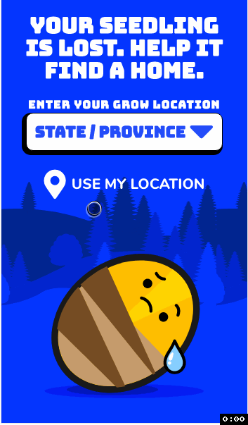
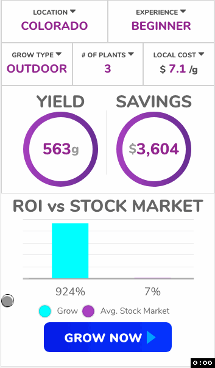

# Grow vs Buy Calculator
The client was in need of a calculator that compared the costs savings of growing cannabis (where legal) in place of purchasing it from a dispensary. 

The tool automatically adjusts the calculations based on the users selection (experience level, geographic location, local cost, etc).  
All calculations are driven all an external CSV file so that as marijuana markets adjust, the client is able to make change to the application with out incurring in additional development cost.   

I was responsible for all of the development while the client provided designs and branding. The entire app was built using VueJS and 100% custom CSS (no CSS framework was used) and ChartJS. 

Link: [https://grizzle.com/marijuana-grow-savings-tool/](https://grizzle.com/marijuana-grow-savings-tool/)

## Clients comments
> It was great working with Maurice on the development of our web application. He was extremely communicative and delivered an excellent final product.

## Screenshots

Landing page

custom location selector with ability to filter or use access GPS

interactive dashboard using ChartJS and custom Vue components

## Code

[return to portfolio](/portfolio/)