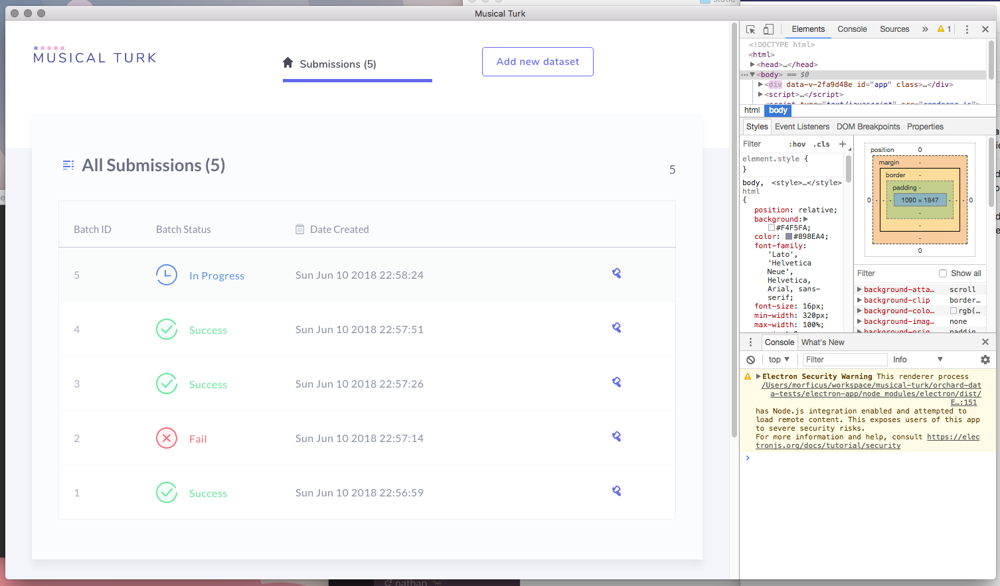
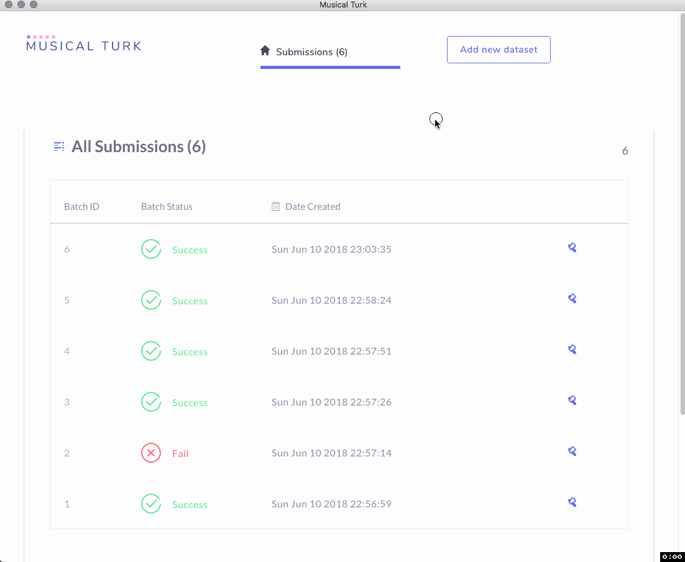
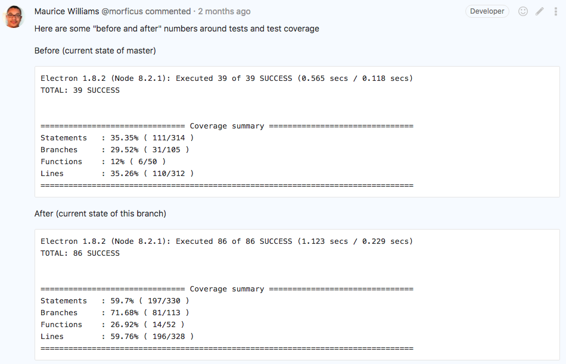
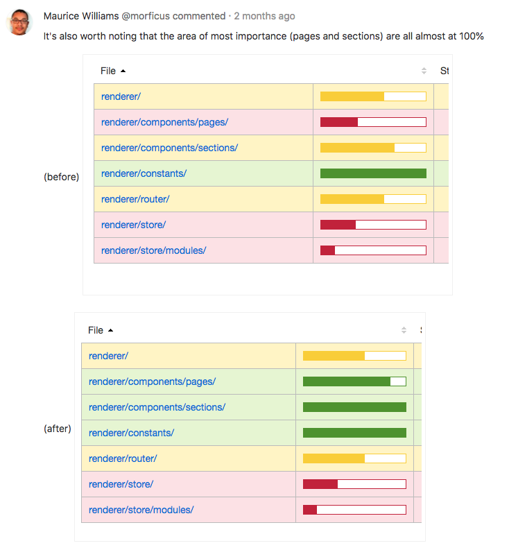

# Musical Turk

This was a music metadata quality analyzer. It allowed users to upload TSV files and would run multiple analysis algorithms on it to determine a quality rating based on the iTunes style guide as well as an general quality rating.

The apps UI was written in Vue with no CSS frameworks, 100% custom styling. It also had an embedded sqlite DB and ran an instance of Node.js in the background for processing the files and serving up data. All of this was distributed as an Electron app.

I was part of a 6 person development team and was responsible for addressing defects and improving code and application quality, on top of implementing specific features.

## Screenshots

[return to portfolio](/portfolio/)