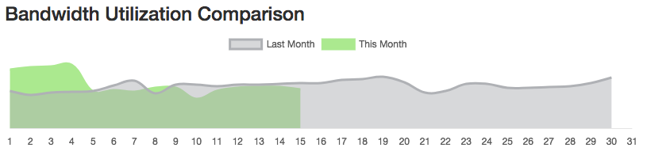
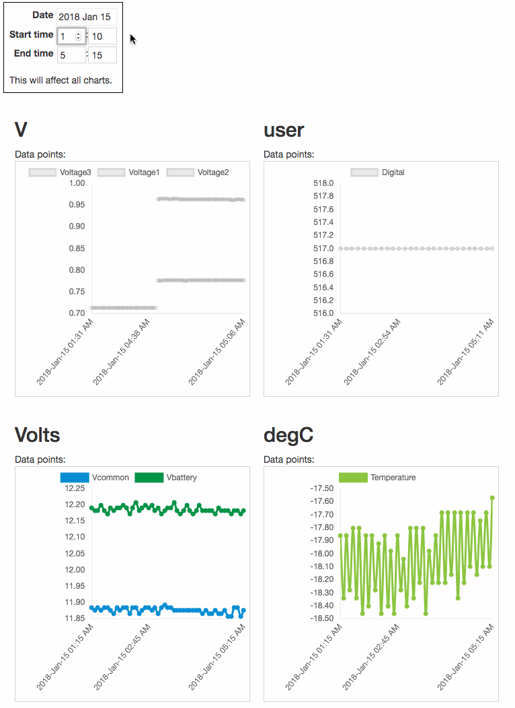

# Telemetry Data Visualization
The client was in the process of migrating their internal customer portal from ColdFusion to a modern platform.    
My responsibilities were only to create very specific components that would help his customers visualize historical data
collected from various field monitoring sensors.  

All charts were made with [ChartJS](https://www.chartjs.org/) inside custom Vue components.
 
## Clients comments
> Maurice is great to work with, and his work product is excellent - well thought out, clear and working. Great at collaboration and helping explain the underlying technologies. 

## Screenshots

Based on the data fed to the chart, it would compare utilization data for the current month (green) with last months (gray)

Visualization for multiple metrics with in a given time frame. As the user adjusted the date/time window, all charts would dynamically update

## Code

[return to portfolio](/portfolio/)